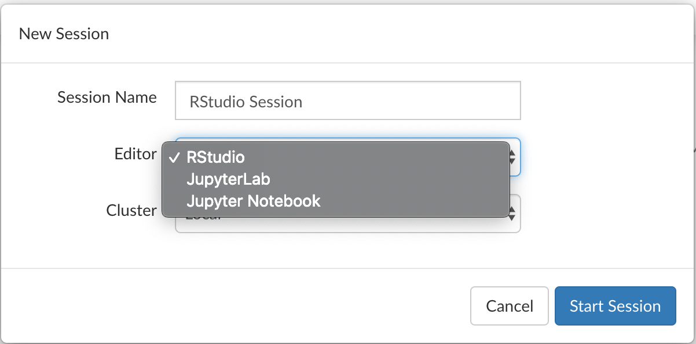
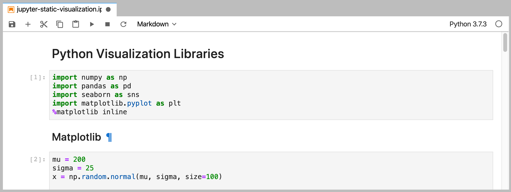

# Welcome to Jupyter

Jupyter Notebooks and Jupyter Lab are popular environments for developing Python code. Starting in version 1.2.5, RStudio Server Pro can be configured to [provide users with access to Jupyter Sessions](https://blog.rstudio.com/2019/09/19/rstudio-1-2-5-release/). This repository contains a few example Jupyter Notebooks and Python scripts that can be used to explore those features.

## Getting Started
Log in to the RStudio IDE and click on New Session. Then select either JupyterLab or Jupyter Notebook from the Editor menu:

Once the session is started, open up [jupyter-static-visualization](jupyter-static-visualization) and then click on `jupyter-static-visualization.ipynb` to open up the Jupyter Notebook.

Once the notebook is running, you can execute code cells by either clicking the "play" button in the menu bar or by pressing Shift + Enter from within a cell.

## More Information
A more complete set of R + Python examples [is available on GitHub](https://github.com/sol-eng/python-examples). More information about RStudio can be found at [RStudio.com](https://rstudio.com/) and you can learn more about Jupyter by visiting [jupyter.org](https://jupyter.org/).